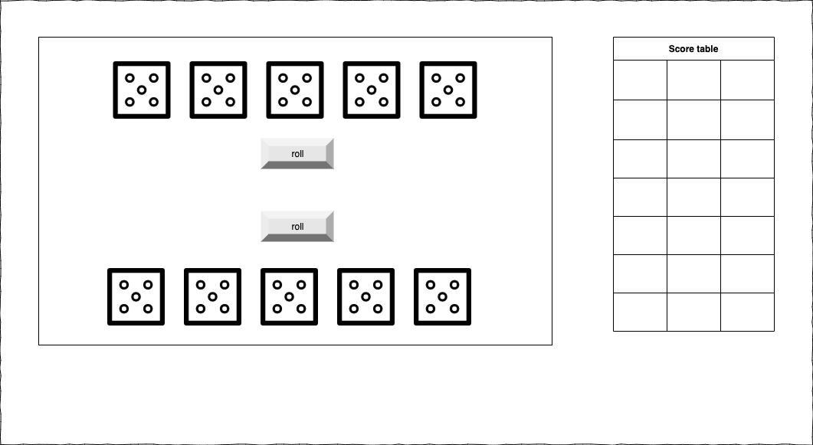
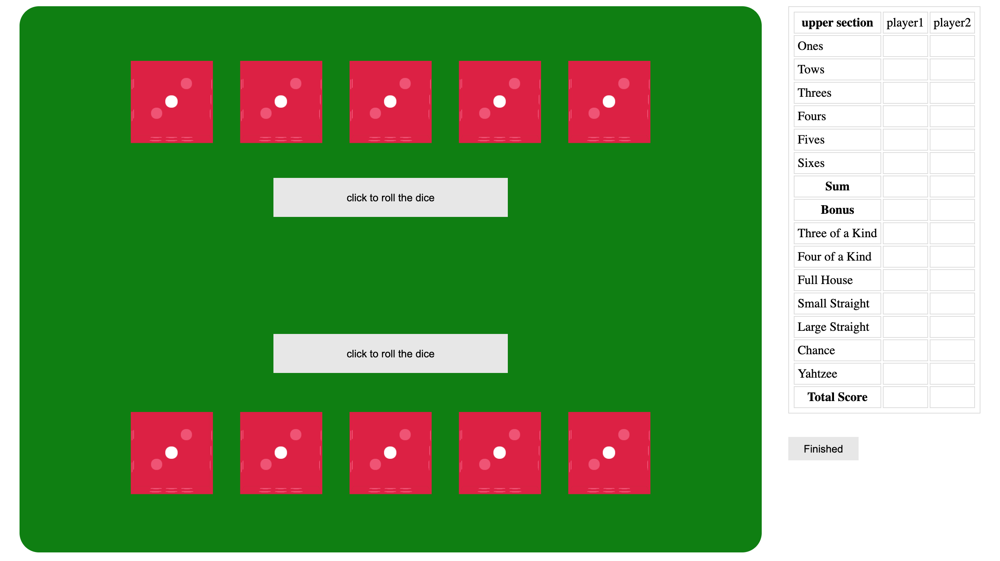
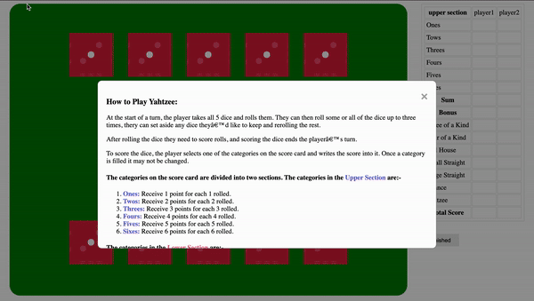

# Project-1/Yahtzee Game

## Game name: Yahtzee  

Yahtzee is a classic dice game that uses five 6-sided dice. It’s easy to learn, quick to play, and accommodates any number of players. 

## How to Play Yahtzee:

At the start of a turn, the player takes all 5 dice and rolls them. They can then roll some or all of the dice up to three times, they can set aside any dice they like to keep and rerolling the rest.

After rolling the dice they need to score rolls, and scoring the dice ends the players turn.

To score the dice, the player selects one of the categories on the score card and writes the score into it. Once a category is filled it may not be changed.

###  The categories in the Upper Section are:-
-----

| Category | Description |
----------- | ------------- 
| Ones   | Receive 1 point for each 1 rolled |
| Twos   | Receive 2 points for each 2 rolled |
| Threes   | Receive 3 points for each 3 rolled |
| Fours   | Receive 4 points for each 4 rolled |
| Fives   | Receive 5 points for each 5 rolled |
| Sixes   | Receive 6 points for each 6 rolled |

 

### The categories in the Lower Section are:- 
----

| Category | Description |
----------- | ------------- 
| Three of a Kind:   | Three dice of the same number Receive sum of the three rolls|
| Four of a Kind   | Four dice of the same number Receive sum of the four rolls |
| Full House   | Three dice showing the same number, and two dice showing another number Receive 25 point |
| Small Straight   | Any four consecutive numbers Receive 30 point |
| Large Straight   | Any five consecutive numbers Receive 40 point |
| Yahtzee   | All 5 dice showing the same number Receive 50 point |
| Chance   | Any combination of dice Receive sum of all the spots on all the dice |

 

## Wirframe of the game: 
---
 

## Screenshot of the game: 
---

 

 

# Game deployment link
https://pages.git.generalassemb.ly/MaryamBalabeed/Project-1/

